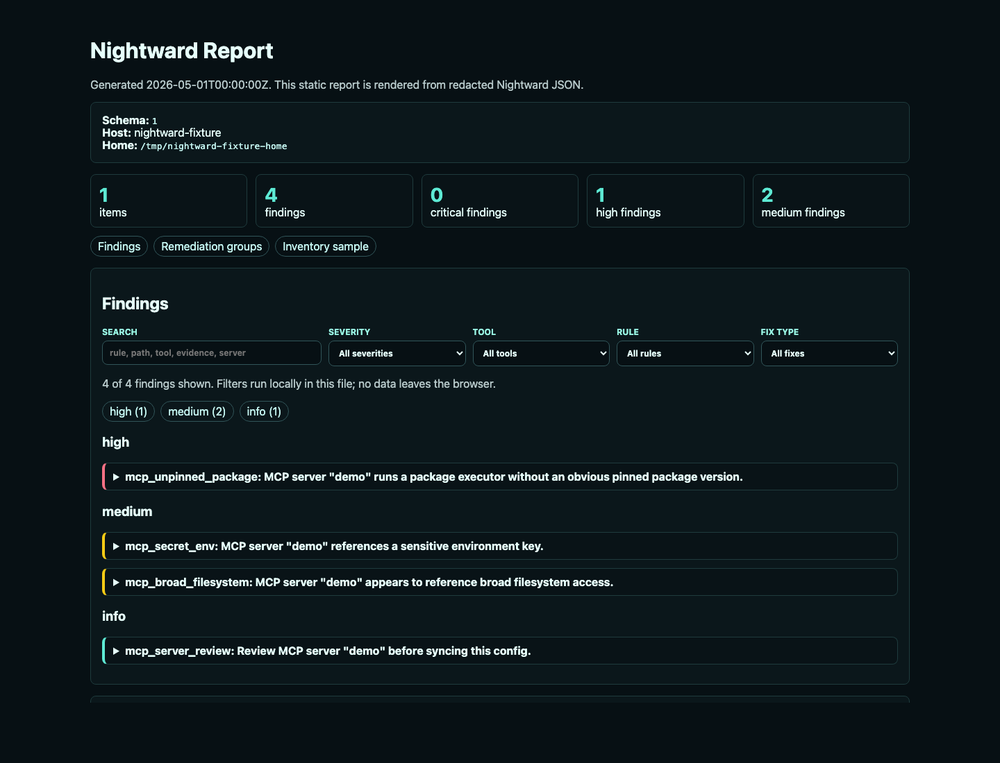
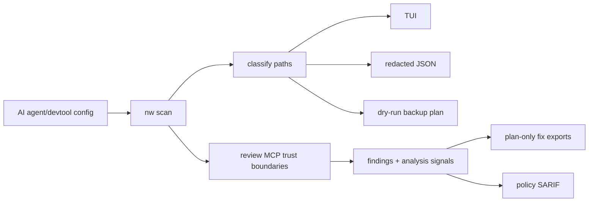
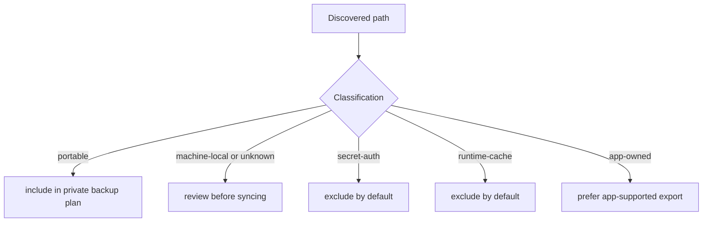
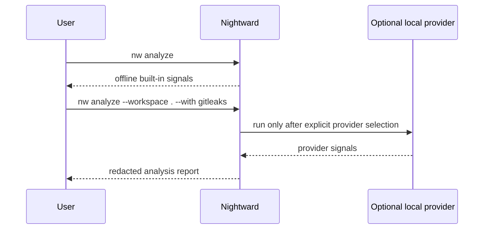

# Nightward

[](https://github.com/JSONbored/nightward/actions/workflows/ci.yml)
[](https://github.com/JSONbored/nightward/actions/workflows/nightward-policy.yml)
[](https://github.com/JSONbored/nightward/actions/workflows/scorecard.yml)
[](https://www.bestpractices.dev/projects/12713)
[](LICENSE)

Nightward finds AI-tool risks before you sync: MCP risk, local-only state, secret exposure, and reviewable fix plans, all locally.

It scans common Codex, Claude, Cursor, Windsurf, VS Code, Raycast, JetBrains, Zed, Continue, Cline/Roo, Aider, OpenCode, Goose, LM Studio, Ollama/Open WebUI, Neovim, MCP config locations, and repo/workspace AI config; classifies what is portable versus local-only or secret; highlights MCP security findings; and produces redacted analysis signals, fix plans, SARIF policy output, snapshot plans, and dry-run backup plans.

Nightward does not mutate agent configs. It only writes explicit report/SARIF files when requested. Schedule install/remove commands are plan-only in v1.

> [!IMPORTANT]
> Nightward is local-first by design: no telemetry, no default network calls, no cloud dashboard, and no live agent-config mutation.

## At A Glance

| Surface | What it does | Default write behavior |
| --- | --- | --- |
| TUI | Dashboard, inventory, findings, analysis, fix plan, backup preview | Read-only except explicit redacted export |
| CLI | Scriptable scan, doctor, policy, SARIF, snapshot, schedule commands | Read-only unless explicit output/export paths are requested |
| MCP server | Read-only stdio tools/resources for AI clients | No writes, no network listener, no online providers |
| Raycast | macOS read-only companion commands | Clipboard/report-folder actions only |
| GitHub Action | Workspace policy and SARIF checks | Writes only requested CI outputs |
| Trunk plugin | Local workspace policy/analyze linters | Emits SARIF to stdout |

## Sample Output

The sample below is generated from the committed fixture home at [testdata/homes/policy](testdata/homes/policy). Hostname, HOME, local paths, timestamps, and secret-looking fixture values are scrubbed before the JSON, report, or screenshot is committed.



- [Scrubbed sample scan JSON](site/public/demo/nightward-sample-scan.json)
- [Static HTML report](site/public/demo/nightward-sample-report.html)
- [OpenTUI gallery](site/guide/tui.md), [walkthrough GIF](site/public/demo/nightward-opentui.gif), and [homepage WebM loop](site/public/demo/tui/nightward-opentui.webm)
- Regenerate the JSON, HTML report, and report screenshot with `make demo-assets` using Chrome, Chromium, Brave, or `NIGHTWARD_CHROME=/path/to/browser`. Regenerate fixture-only TUI media with `make tui-media` and review every frame before committing.



## Why

AI coding tools scatter useful state across config files, MCP server definitions, skills, rules, commands, extension settings, credentials, caches, and app-owned databases. Blindly syncing all of it is fragile and unsafe.

Nightward answers the practical questions first:

- What exists on this machine?
- What is portable enough for a private dotfiles repo?
- What is machine-local, app-owned, runtime cache, or credential material?
- Which MCP configs deserve security review?
- What exact remediation plan should I consider before syncing?
- What would a backup plan include, review, or exclude before it writes anything?

## Highlights

- OpenTUI-powered interactive app with dashboard, findings, analysis, fix plan, inventory, backup preview, and help sections.
- `nightward` canonical command plus `nw` short alias.
- Redacted JSON for automation and CI.
- HOME scanning for local machines and `--workspace` scanning for CI, Trunk, and dotfiles repos.
- MCP findings for unpinned package execution, shell wrappers, sensitive env keys, sensitive headers, local endpoints, broad filesystem access, token paths, parse failures, and unknown server shapes.
- Offline analysis signals for supply-chain, secret exposure, filesystem scope, network exposure, execution risk, machine-local, and app-owned state review.
- Optional provider framework for local and online-capable tools; CLI providers never auto-install and online-capable providers stay blocked unless explicitly enabled.
- Scan summaries separate inventory buckets from finding buckets: item classification/risk/tool counts are distinct from finding severity/rule/tool counts.
- Plan-only remediation metadata: fix kind, confidence, risk, review requirement, impact, and steps.
- SARIF output for GitHub code scanning.
- Importable Trunk plugin definition for `nightward-policy` and `nightward-analyze` from pinned release tags.
- Optional `.nightward.yml` policy config with reason-required ignores.
- Redacted plan-only remediation exports for parseable MCP config findings.
- Read-only snapshot plan commands.
- Reusable GitHub Action for scan, policy, and SARIF modes.
- Read-only Raycast extension for Dashboard, Findings, Analysis, Provider Doctor, Explain Finding/Signal, Fix Plan/Analysis export, and report-folder access.
- Read-only stdio MCP server for AI clients that need local scan, finding, rule, provider, policy, and fix-plan context.
- User-level nightly scan scheduling for macOS launchd, Linux systemd user timers, and cron text fallback.
- No telemetry, no cloud dashboard, no default network calls from Nightward runtime, and no live config mutation.
- OpenSSF-oriented project hygiene: DCO, governance docs, threat model, coverage gate, pinned CI actions, release snapshot checks, signed release configuration, and security reporting policy.

> [!TIP]
> A practical first pass is `nw`, then `nw scan --json`, then `nw doctor --json`.

## Install

Try the release-gated npm launcher:

```sh
npx @jsonbored/nightward scan
npm install -g @jsonbored/nightward
nw
```

This installs one Nightward CLI distribution with two command names:

- `nightward`: canonical project command
- `nw`: short alias for frequent terminal/TUI use

For local development from this checkout:

```sh
make install-local
```

The npm package is intentionally a thin launcher for GitHub Release binaries. It does not run a `postinstall` script; on first execution it downloads the matching release archive, verifies the archive SHA-256 from `checksums.txt`, caches the binaries locally, and then runs `nightward` or `nw`.

## Quick Start

Open the TUI:

```sh
nw
```

Review a saved scan in the same TUI:

```sh
nw tui --input scan.json
```

Scan local HOME state and emit redacted JSON:

```sh
nw scan --json
```

Scan a repo/workspace instead of HOME:

```sh
nw scan --workspace . --json
```

Check local assumptions:

```sh
nw doctor --json
```

List and explain findings:

```sh
nw findings list
nw findings explain mcp_unpinned_package-abc123
```

Generate a plan-only fix report:

```sh
nw fix plan --json
nw fix plan --rule mcp_secret_env
nw fix export --format markdown
```

Run offline analysis and provider checks:

```sh
nw analyze --json
nw analyze --workspace . --json
nw analyze package npm:@modelcontextprotocol/server-filesystem --json
nw analyze finding mcp_unpinned_package-abc123 --json
nw providers list --json
nw providers doctor --with socket --json
nw rules list --json
nw rules explain mcp_secret_header --json
```

Online-capable providers remain blocked until explicitly allowed:

```sh
nw providers doctor --with socket --online --json
nw analyze --workspace . --with trivy,osv-scanner,socket --online --json
```

Create or explain policy config:

```sh
nw policy init
nw policy explain
nw policy check --config .nightward.yml --strict --json
```

Generate a dry-run backup plan:

```sh
nw plan backup
```

Generate a read-only snapshot plan:

```sh
nw snapshot plan --output ~/nightward-snapshots --json
```

Render a local static HTML report from redacted scan JSON:

```sh
nw scan --json --output /tmp/nightward-scan.json
nw report html --input /tmp/nightward-scan.json --output /tmp/nightward-report.html
nw report diff --from /tmp/previous-scan.json --to /tmp/nightward-scan.json
nw report html
nw report history
nw report latest
```

Run policy checks or generate SARIF:

```sh
nw policy check --strict --json
nw policy sarif --output nightward.sarif
nw policy check --workspace . --include-analysis --strict --json
nw policy sarif --workspace . --include-analysis --output -
nw policy badge --workspace . --include-analysis --sarif-url https://example.invalid/nightward.sarif --output nightward-badge.json
```

Expose Nightward to MCP-capable AI clients:

```sh
nw mcp serve
```

Preview scheduled nightly scans:

```sh
nw schedule plan --preset nightly
nw schedule install --preset nightly --dry-run
nw schedule remove --dry-run
```

## Classification Model

Nightward classifies discovered state as:

- `portable`: usually safe to sync after review
- `machine-local`: tied to local paths, identities, or machine assumptions
- `secret-auth`: credentials or auth material; excluded by default
- `runtime-cache`: generated runtime data; excluded by default
- `app-owned`: databases, extension binaries, encrypted app state, or caches owned by another app
- `unknown`: found state Nightward cannot classify confidently

Backup plans include portable items, mark machine-local/unknown items for review, and exclude secret/auth, runtime-cache, and app-owned state by default.



> [!WARNING]
> Do not blindly sync `secret-auth`, `runtime-cache`, or `app-owned` paths. Nightward excludes them by default because those files often contain credentials, generated state, or app-private databases.

## Fix Plan Model

Nightward does not apply fixes yet. "Autofix" currently means structured, reviewable fix plans:

- `pin-package`: pin `npx`, `uvx`, or `pipx` package execution when the package name is parseable
- `externalize-secret`: move inline secret values out of agent config and keep only env key names or setup docs
- `replace-shell-wrapper`: replace simple shell passthroughs with direct executable invocation
- `narrow-filesystem`: replace broad filesystem access with explicit paths after human review
- `manual-review`: inspect unsupported, ambiguous, or high-risk config manually
- `ignore-with-reason`: keep an advisory finding only after documenting why it is expected

Secret values are never emitted in scan JSON, findings output, fix-plan JSON, Markdown exports, SARIF, or TUI detail text.

`scan --json` is pre-1.0 and may make breaking shape improvements. The current summary schema uses explicit keys such as `items_by_classification`, `items_by_risk`, `findings_by_severity`, and `findings_by_rule` so item risk is not confused with finding severity.

## Analysis Model

`nw analyze` turns scan findings and classifications into explainable signals. It does not claim a package, server, binary, or URL is safe. It reports what Nightward can prove from local structure, why it matters, and how confident the signal is.

Default analysis is offline and built in. Optional providers are discovered by `providers doctor`; Nightward does not install them or call online services unless a user explicitly selects providers and opts into network-capable behavior. Explicit local providers are `gitleaks`, `trufflehog`, and `semgrep`. Online-capable providers are `trivy`, `osv-scanner`, and `socket`, and they require both `--with` and `--online`. Socket support creates a remote Socket scan artifact from dependency manifest metadata; Nightward does not fetch or normalize remote Socket reports in v1.

Provider runs use timeouts, bounded output capture, and redacted metadata only. Semgrep execution requires a repo-local config file so Nightward does not use automatic rule discovery by default.

Policy config can enable analysis and selected provider execution with `include_analysis`, `analysis_threshold`, `analysis_providers`, and `allow_online_providers`; online-capable providers still require explicit policy opt-in.



## TUI

The default `nightward` / `nw` command opens the TUI:

- Dashboard: scan counts and schedule status
- Inventory: discovered paths by tool, classification, and risk
- Findings: severity/tool/rule filters with a selected-finding detail pane
- Analysis: offline risk signals and provider warning summary
- Fix Plan: safe/review/blocked remediation groups
- Backup Plan: private-dotfiles dry-run preview

The TUI is now part of the Rust CLI binary and uses `opentui_rust` directly for the colored dashboard, filled panels, severity ribbons, and fixture-driven screenshots. Release archives and npm-downloaded binaries only need `nightward` and `nw`.

Keyboard shortcuts:

- `1`-`7`: switch sections
- arrow keys or `h`/`j`/`k`/`l`: navigate
- `/`: search findings
- `s`: cycle severity
- `x`: clear filters
- `q` or `esc`: quit

Fixture-only OpenTUI demo: [TUI gallery](site/guide/tui.md), [dashboard PNG](site/public/demo/tui/overview.png), [walkthrough GIF](site/public/demo/nightward-opentui.gif), and [homepage WebM loop](site/public/demo/tui/nightward-opentui.webm).

## MCP Server

Nightward can expose local, read-only context to MCP-capable AI clients:

```json
{
  "mcpServers": {
    "nightward": {
      "command": "nw",
      "args": ["mcp", "serve"]
    }
  }
}
```

The server supports scan, doctor, findings, finding explanation, fix-plan, policy-check, and rules tools plus latest-summary and rules resources. It uses stdio only, does not open a network listener, does not mutate config, and does not enable online-capable providers in v1.

## GitHub Action

Nightward can run as a local GitHub Action in scan, policy, or SARIF mode:

```yaml
- uses: JSONbored/nightward@v0.1.4
  with:
    mode: sarif
    output: nightward.sarif
```

See [docs/action.md](docs/action.md) for inputs, outputs, and SARIF upload examples.

## Website

Nightward's public docs/marketing site lives in [site](site) and uses VitePress with local search. It is designed as a repo-owned static site with no analytics by default.

```sh
cd site
npm ci
npm run build
```

See [docs/website.md](docs/website.md) for the page map and Stitch landing-page brief.

## Trunk Plugin

Nightward includes an in-repo `plugin.yaml` for Trunk Check. Import a pinned release tag and enable repo/workspace policy scans:

```sh
trunk plugins add --id nightward https://github.com/JSONbored/nightward v0.1.4
trunk check enable nightward-policy
```

`nightward-policy` emits SARIF from `nw policy sarif --workspace ${workspace} --output -`. `nightward-analyze` adds offline analysis signals with `--include-analysis`.

## Raycast Extension

The read-only Raycast extension lives in [integrations/raycast](integrations/raycast).

```sh
cd integrations/raycast
npm ci
npm run build
npm run dev
```

Commands:

- `Nightward Dashboard`
- `Nightward Status`
- `Nightward Findings`
- `Nightward Analysis`
- `Nightward Provider Doctor`
- `Explain Nightward Finding`
- `Explain Nightward Signal`
- `Export Nightward Fix Plan`
- `Export Nightward Analysis`
- `Open Nightward Reports`

The extension shells out to `nw` or `nightward`, renders redacted output, copies explicitly requested exports, and opens the local reports folder. Provider Doctor can enable/disable provider selection for Raycast Analysis and, after confirmation, install known provider CLIs with the displayed Homebrew/npm command. It does not mutate agent configs or install schedules.

See [docs/raycast-extension.md](docs/raycast-extension.md) for preferences, validation, and read-only boundaries.

## Scheduling

The plan-only `nightly` preset describes running:

```sh
nightward scan --json
```

Planned user-level schedule targets:

- macOS: `launchd` user agent
- Linux: systemd user timer
- Other platforms: generated cron text only

Schedule plans never copy secrets, mutate dotfiles, restore files, or push to Git.

## Development

```sh
make test
make test-race
make test-junit
make coverage-check
make trunk-flaky-validate
make trunk-check
make ci-scripts-test
make raycast-verify
make npm-package-verify
make release-snapshot
make verify
cargo run --bin nightward -- --help
cargo run --bin nw -- scan --json
cargo run --bin nw -- scan --workspace . --json
cargo run --bin nw -- scan --json | jq '.summary'
cargo run --bin nw -- findings list --json
cargo run --bin nw -- findings list --json | jq '[.[] | select(.rule=="mcp_server_review")]'
cargo run --bin nw -- analyze --all --json
cargo run --bin nw -- providers doctor --json
cargo run --bin nw -- rules list --json
cargo run --bin nw -- fix plan --json
cargo run --bin nw -- fix export --format markdown
cargo run --bin nw -- policy sarif --output /tmp/nightward.sarif
cargo run --bin nw -- policy sarif --workspace . --include-analysis --output -
cargo run --bin nw -- schedule plan --json
```

Local security checks used by maintainers:

```sh
trunk check --show-existing --all
make gitleaks
make cargo-audit
make cargo-deny
make coverage-check
make release-snapshot
```

## Project Docs

- [Security policy](SECURITY.md)
- [Governance](GOVERNANCE.md)
- [Maintainers](MAINTAINERS.md)
- [Contributing guide](CONTRIBUTING.md)
- [Contributing fixtures](docs/contributing-fixtures.md)
- [Code of conduct](CODE_OF_CONDUCT.md)
- [Support](SUPPORT.md)
- [Roadmap](ROADMAP.md)
- [Install and release channels](docs/install.md)
- [Distribution plan](docs/distribution.md)
- [Website and docs plan](docs/website.md)
- [Growth backlog](docs/growth.md)
- [Adapters](docs/adapters.md)
- [Analysis](docs/analysis.md)
- [Remediation](docs/remediation.md)
- [Testing](docs/testing.md)
- [Dependency maintenance](docs/dependency-maintenance.md)
- [GitHub Action](docs/action.md)
- [MCP server](docs/mcp-server.md)
- [Raycast extension](docs/raycast-extension.md)
- [CI/security notes](docs/ci-security.md)
- [Release process](docs/release.md)
- [Threat model](docs/threat-model.md)
- [OpenSSF evidence](docs/openssf-best-practices.md)
- [Privacy model](docs/privacy-model.md)
- [Screenshot/GIF capture plan](docs/screenshots.md)

## Contributors

[](https://github.com/JSONbored/nightward/graphs/contributors)

## Star History

[](https://www.star-history.com/#JSONbored/nightward&Date)

## License

MIT
