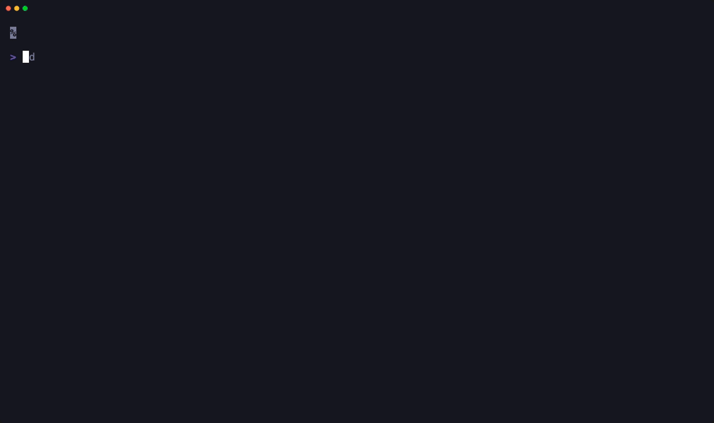
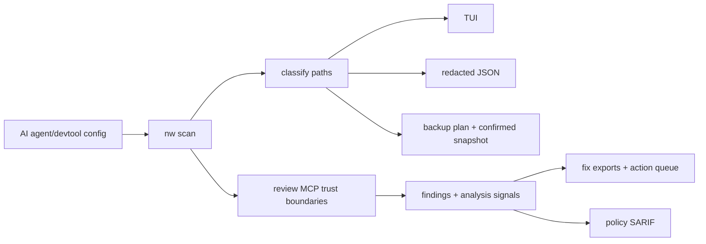
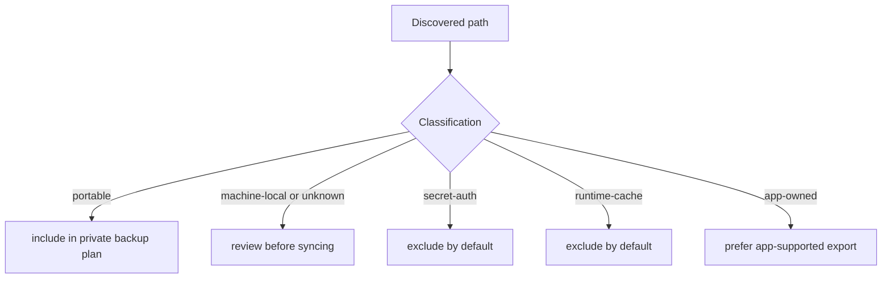
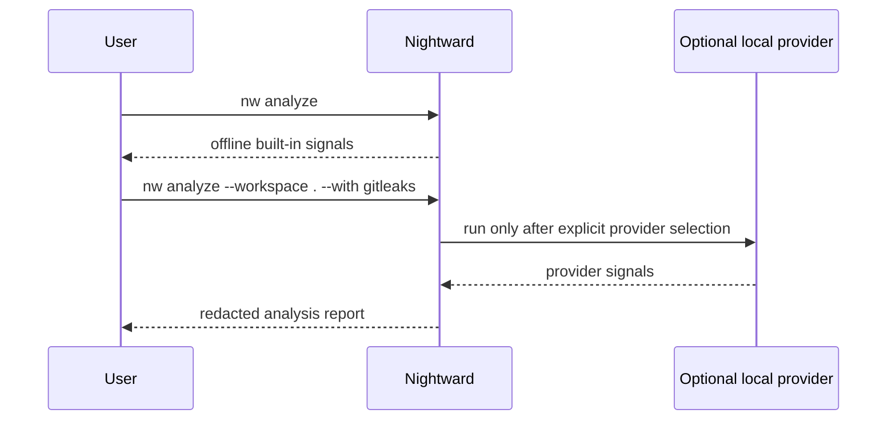

# Nightward

[](https://github.com/JSONbored/nightward/actions/workflows/ci.yml)
[](https://github.com/JSONbored/nightward/actions/workflows/nightward-policy.yml)
[](https://github.com/JSONbored/nightward/actions/workflows/scorecard.yml)
[](https://www.bestpractices.dev/projects/12713)
[](LICENSE)

Nightward finds AI-tool risks before you sync: MCP risk, local-only state, secret exposure, and reviewable fix plans, all locally.

It scans common Codex, Claude, Cursor, Windsurf, VS Code, Raycast, JetBrains, Zed, Continue, Cline/Roo, Aider, OpenCode, Goose, LM Studio, Ollama/Open WebUI, Neovim, MCP config locations, and repo/workspace AI config; classifies what is portable versus local-only or secret; highlights MCP security findings; and produces redacted analysis signals, fix plans, SARIF policy output, snapshot plans, and dry-run backup plans.

Public docs and the fixture TUI walkthrough live at <https://nightward.aethereal.dev/>.

Nightward is read-only by default, but it can run explicit, confirmation-gated local actions such as provider installation, provider enable/disable, scheduled scan install/remove, portable config snapshots, policy ignores, and Nightward-owned report/cache cleanup.

> [!IMPORTANT]
> Nightward is local-first by design: no telemetry, no default network calls, and no cloud dashboard. Write-capable actions are beta operator tools. Users must review previews, confirmations, backups, package-manager behavior, and third-party provider behavior before applying changes. Nightward is provided without warranty, and maintainers are not liable for broken configs, lost data, exposed secrets, or third-party tool side effects.

## TUI Preview

[](site/guide/tui.md)

The README uses a GIF so the preview renders directly on GitHub. The docs homepage uses the lighter [WebM loop](site/public/demo/tui/nightward-opentui.webm), and the [TUI guide](site/guide/tui.md) keeps the full seven-screen gallery.

## At A Glance

| Surface | What it does | Default write behavior |
| --- | --- | --- |
| TUI | Dashboard, inventory, findings, analysis, fix plan, backup preview, action queue | Read-only until a confirmed action is applied |
| CLI | Scriptable scan, doctor, policy, SARIF, snapshot, schedule, backup, and action commands | Read-only unless explicit output/export paths or `--confirm` actions are requested |
| MCP server | Stdio tools/resources/prompts for AI clients | Read-only; can list/preview actions, but writes must be applied in CLI/TUI/Raycast |
| Raycast | macOS companion commands plus confirmed Nightward Actions | Clipboard/report-folder actions plus confirmation-gated writes |
| GitHub Action | Workspace policy and SARIF checks | Writes only requested CI outputs |
| Trunk plugin | Local workspace policy/analyze linters | Emits SARIF to stdout |

## Sample Output

The sample below is generated from the committed fixture home at [testdata/homes/policy](testdata/homes/policy). Hostname, HOME, local paths, timestamps, and secret-looking fixture values are scrubbed before the JSON, report, or screenshot is committed.


- [Scrubbed sample scan JSON](site/public/demo/nightward-sample-scan.json)
- [Static HTML report](site/public/demo/nightward-sample-report.html)
- [OpenTUI gallery](site/guide/tui.md), [walkthrough GIF](site/public/demo/nightward-opentui.gif), and [homepage WebM loop](site/public/demo/tui/nightward-opentui.webm)
- Regenerate the JSON, HTML report, and report screenshot with `make demo-assets` using Chrome, Chromium, Brave, or `NIGHTWARD_CHROME=/path/to/browser`. Regenerate fixture-only TUI media with `make tui-media` and review every frame before committing.



## Why

AI coding tools scatter useful state across config files, MCP server definitions, skills, rules, commands, extension settings, credentials, caches, and app-owned databases. Blindly syncing all of it is fragile and unsafe.

Nightward answers the practical questions first:

- What exists on this machine?
- What is portable enough for a private dotfiles repo?
- What is machine-local, app-owned, runtime cache, or credential material?
- Which MCP configs deserve security review?
- What exact remediation plan should I consider before syncing?
- What would a backup plan include, review, or exclude before it writes anything?

## Highlights

- OpenTUI-powered interactive app with dashboard, findings, analysis, fix plan, inventory, backup preview, action queue, and help sections.
- `nightward` canonical command plus `nw` short alias.
- Redacted JSON for automation and CI.
- HOME scanning for local machines and `--workspace` scanning for CI, Trunk, and dotfiles repos.
- MCP findings for unpinned package execution, package-name impersonation risk, remote package sources, shell wrappers, Docker/socket exposure, sensitive env keys, sensitive headers, local/private endpoints, broad filesystem access, token paths, stale configs, app-owned state, parse failures, and unknown server shapes.
- Offline analysis signals for supply-chain, secret exposure, filesystem scope, network exposure, execution risk, machine-local, and app-owned state review.
- Optional provider framework for Gitleaks, TruffleHog, Semgrep, Trivy, OSV-Scanner, Grype, Syft, OpenSSF Scorecard, and Socket; provider installs and online-capable execution stay confirmation/opt-in gated.
- Scan summaries separate inventory buckets from finding buckets: item classification/risk/tool counts are distinct from finding severity/rule/tool counts.
- Remediation metadata: fix kind, confidence, risk, review requirement, impact, steps, and bounded action specs where Nightward can safely preview writes.
- SARIF output for GitHub code scanning.
- Importable Trunk plugin definition for `nightward-policy` and `nightward-analyze` from pinned release tags.
- Optional `.nightward.yml` policy config with reason-required ignores.
- Redacted plan-only remediation exports for parseable MCP config findings.
- Read-only snapshot plans plus confirmed portable config snapshot creation.
- Reusable GitHub Action for scan, policy, and SARIF modes.
- Raycast extension for Dashboard, Findings, Analysis, Provider Doctor, Nightward Actions, Explain Finding/Signal, Fix Plan/Analysis export, and report-folder access.
- Stdio MCP server for AI clients that need local scan, analysis, finding, rule, provider, policy, report, prompt, fix-plan, and bounded action context.
- User-level nightly scan scheduling for macOS launchd and Linux systemd user timers.
- No telemetry, no cloud dashboard, and no default network calls from Nightward runtime.
- OpenSSF-oriented project hygiene: DCO, governance docs, threat model, coverage gate, pinned CI actions, release snapshot checks, signed release configuration, and security reporting policy.

> [!TIP]
> A practical first pass is `nw`, then `nw scan --json`, then `nw doctor --json`.

## Install

Try the release-gated npm launcher:

```sh
npx @jsonbored/nightward scan
npm install -g @jsonbored/nightward
nw
```

This installs one Nightward CLI distribution with two command names:

- `nightward`: canonical project command
- `nw`: short alias for frequent terminal/TUI use

For local development from this checkout:

```sh
make install-local
```

The npm package is intentionally a thin launcher for GitHub Release binaries. It does not run a `postinstall` script; on first execution it downloads the matching release archive, verifies the archive SHA-256 from `checksums.txt`, rejects unsafe archive entries before extraction, caches the binaries locally, and then runs `nightward` or `nw`. Strict environments can set `NIGHTWARD_NPM_REQUIRE_SIGSTORE=1` to require Cosign verification of `checksums.txt.sigstore.json` before trusting the checksum file.

## Quick Start

Open the TUI:

```sh
nw
```

Review a saved scan in the same TUI:

```sh
nw tui --input scan.json
```

Scan local HOME state and emit redacted JSON:

```sh
nw scan --json
```

Scan a repo/workspace instead of HOME:

```sh
nw scan --workspace . --json
```

Check local assumptions:

```sh
nw doctor --json
```

Accept the beta responsibility disclosure before write-capable actions:

```sh
nw disclosure accept
```

List and explain findings:

```sh
nw findings list
nw findings explain mcp_unpinned_package-abc123
```

Generate a plan-only fix report:

```sh
nw fix plan --json
nw fix plan --rule mcp_secret_env
nw fix export --format markdown
```

Run offline analysis and provider checks:

```sh
nw analyze --json
nw analyze --workspace . --json
nw analyze package npm:@modelcontextprotocol/server-filesystem --json
nw analyze finding mcp_unpinned_package-abc123 --json
nw providers list --json
nw providers doctor --with syft,gitleaks --json
nw rules list --json
nw rules explain mcp_secret_header --json
```

Online-capable providers remain blocked until explicitly allowed:

```sh
nw providers doctor --with trivy,grype,scorecard,socket --online --json
nw analyze --workspace . --with trivy,osv-scanner,grype,scorecard,socket --online --json
```

Create or explain policy config:

```sh
nw policy init
nw policy explain
nw policy check --config .nightward.yml --strict --json
nw actions apply policy.ignore --finding mcp_server_review-abc123 --reason "reviewed locally" --confirm
```

Generate a dry-run backup plan:

```sh
nw plan backup
```

Generate a read-only snapshot plan:

```sh
nw snapshot plan --output ~/nightward-snapshots --json
```

Render a local static HTML report from redacted scan JSON:

```sh
nw scan --json --output /tmp/nightward-scan.json
nw report html --input /tmp/nightward-scan.json --output /tmp/nightward-report.html
nw report diff --from /tmp/previous-scan.json --to /tmp/nightward-scan.json
nw report html --from /tmp/previous-scan.json --to /tmp/nightward-scan.json --output /tmp/nightward-report.html
nw tui --from /tmp/previous-scan.json --to /tmp/nightward-scan.json
nw report html
nw report history
nw report latest
```

Run policy checks or generate SARIF:

```sh
nw policy check --strict --json
nw policy sarif --output nightward.sarif
nw policy check --workspace . --include-analysis --strict --json
nw policy sarif --workspace . --include-analysis --output -
nw policy badge --workspace . --include-analysis --sarif-url https://example.invalid/nightward.sarif --output nightward-badge.json
```

Expose Nightward to MCP-capable AI clients:

```sh
nw mcp serve
```

Preview scheduled nightly scans:

```sh
nw schedule plan --preset nightly
nw schedule install --preset nightly --dry-run
nw schedule remove --dry-run
```

## Classification Model

Nightward classifies discovered state as:

- `portable`: usually safe to sync after review
- `machine-local`: tied to local paths, identities, or machine assumptions
- `secret-auth`: credentials or auth material; excluded by default
- `runtime-cache`: generated runtime data; excluded by default
- `app-owned`: databases, extension binaries, encrypted app state, or caches owned by another app
- `unknown`: found state Nightward cannot classify confidently

Backup plans include portable items, mark machine-local/unknown items for review, and exclude secret/auth, runtime-cache, and app-owned state by default.



> [!WARNING]
> Do not blindly sync `secret-auth`, `runtime-cache`, or `app-owned` paths. Nightward excludes them by default because those files often contain credentials, generated state, or app-private databases.

## Fix Plan Model

Nightward separates review guidance from apply-capable actions. Fix plans remain structured review material for high-risk MCP edits, while the shared action layer can apply bounded local operations when Nightward knows the exact write surface:

- `pin-package`: pin `npx`, `uvx`, or `pipx` package execution when the package name is parseable
- `externalize-secret`: move inline secret values out of agent config and keep only env key names or setup docs
- `replace-shell-wrapper`: replace simple shell passthroughs with direct executable invocation
- `narrow-filesystem`: replace broad filesystem access with explicit paths after human review
- `manual-review`: inspect unsupported, ambiguous, or high-risk config manually
- `ignore-with-reason`: keep an advisory finding only after documenting why it is expected

Secret values are never emitted in scan JSON, findings output, fix-plan JSON, Markdown exports, SARIF, or TUI detail text. Confirmed actions write audit events under Nightward local state.

`scan --json` is pre-1.0 and may make breaking shape improvements. The current summary schema uses explicit keys such as `items_by_classification`, `items_by_risk`, `findings_by_severity`, and `findings_by_rule` so item risk is not confused with finding severity.

## Analysis Model

`nw analyze` turns scan findings and classifications into explainable signals. It does not claim a package, server, binary, or URL is safe. It reports what Nightward can prove from local structure, why it matters, and how confident the signal is.

Default analysis is offline and built in. Optional providers are discovered by `providers doctor`; Nightward does not call online services unless a user explicitly selects providers and opts into network-capable behavior. The CLI/TUI/Raycast action layer can install known provider CLIs after confirmation. MCP can list and preview those actions, but cannot apply local writes. Explicit local providers are `gitleaks`, `trufflehog`, `semgrep`, and `syft`. Online-capable providers are `trivy`, `osv-scanner`, `grype`, `scorecard`, and `socket`, and they require explicit online-provider opt-in. Socket support creates a remote Socket scan artifact from dependency manifest metadata; Nightward does not fetch or normalize remote Socket reports in v1.

Provider runs use explicit skip/block/ready states, timeouts, bounded output capture, and redacted metadata only. Oversized provider stdout fails closed as a provider warning instead of being partially parsed. Semgrep execution requires a repo-local config file so Nightward does not use automatic rule discovery by default.

Policy config can enable analysis and selected provider execution with `include_analysis`, `analysis_threshold`, `analysis_providers`, and `allow_online_providers`; online-capable providers still require explicit policy opt-in.



## TUI

The default `nightward` / `nw` command opens the TUI:

- Dashboard: scan counts and schedule status
- Inventory: discovered paths by tool, classification, and risk
- Findings: severity/tool/rule filters with a selected-finding detail pane
- Analysis: offline risk signals and provider warning summary
- Fix Plan: safe/review/blocked remediation groups
- Backup Plan: private-dotfiles dry-run preview
- Actions: confirmation-gated provider, policy, schedule, backup, cleanup, and setup actions

The TUI is now part of the Rust CLI binary and uses `opentui_rust` directly for the colored dashboard, filled panels, severity ribbons, and fixture-driven screenshots. Release archives and npm-downloaded binaries only need `nightward` and `nw`.

Keyboard shortcuts:

- `1`-`8`: switch sections
- arrow keys or `h`/`j`/`k`/`l`: navigate
- `enter`: confirm selected action in the Actions view
- `/`: search findings
- `s`: cycle severity
- `x`: clear filters
- `q` or `esc`: quit

Fixture-only OpenTUI demo: [TUI gallery](site/guide/tui.md), [dashboard PNG](site/public/demo/tui/overview.png), [walkthrough GIF](site/public/demo/nightward-opentui.gif), and [homepage WebM loop](site/public/demo/tui/nightward-opentui.webm).

## MCP Server

Nightward can expose local context and bounded Nightward action workflows to MCP-capable AI clients:

```json
{
  "mcpServers": {
    "nightward": {
      "command": "nw",
      "args": ["mcp", "serve"]
    }
  }
}
```

The server supports scan, doctor, findings, finding/signal explanation, analysis, fix-plan, policy-check, report history/diff, action list/preview, rules, providers, resources, and prompts. It uses stdio only, does not open a network listener, and cannot rewrite arbitrary MCP or agent config. MCP clients cannot apply local writes because tool-call arguments are not an out-of-band local confirmation channel; use the CLI, TUI, or Raycast extension to apply previewed actions.

## GitHub Action

Nightward can run as a local GitHub Action in scan, policy, or SARIF mode:

```yaml
- uses: JSONbored/nightward@v0.1.4
  with:
    mode: sarif
    output: nightward.sarif
```

See [docs/action.md](docs/action.md) for inputs, outputs, and SARIF upload examples.

## Website

Nightward's public docs/marketing site lives in [site](site) and uses VitePress with local search. It is designed as a repo-owned static site with no analytics by default; the deployed public site can opt into self-hosted Umami through build-time environment variables.

```sh
cd site
npm ci
npm run build
```

See [docs/website.md](docs/website.md) for the page map, custom-domain notes, analytics boundary, and Stitch landing-page brief.

## Trunk Plugin

Nightward includes an in-repo `plugin.yaml` for Trunk Check. Import a pinned release tag and enable repo/workspace policy scans:

```sh
trunk plugins add --id nightward https://github.com/JSONbored/nightward v0.1.4
trunk check enable nightward-policy
```

`nightward-policy` emits SARIF from `nw policy sarif --workspace ${workspace} --output -`. `nightward-analyze` adds offline analysis signals with `--include-analysis`.

## Raycast Extension

The read-only Raycast extension lives in [integrations/raycast](integrations/raycast).

```sh
cd integrations/raycast
npm ci
npm run build
npm run dev
```

Commands:

- `Nightward Dashboard`
- `Nightward Status`
- `Nightward Findings`
- `Nightward Analysis`
- `Nightward Provider Doctor`
- `Nightward Actions`
- `Explain Nightward Finding`
- `Explain Nightward Signal`
- `Export Nightward Fix Plan`
- `Export Nightward Analysis`
- `Open Nightward Reports`

The extension shells out to `nw` or `nightward`, renders redacted output, copies explicitly requested exports, and opens the local reports folder. Provider Doctor can enable/disable provider selection for Raycast Analysis and can preview/apply known provider installs only through the shared action registry. `Nightward Actions` uses that same registry as the CLI/TUI for confirmed provider, policy, schedule, backup, cleanup, and disclosure actions.

See [docs/raycast-extension.md](docs/raycast-extension.md) for preferences, validation, and read-only boundaries.

## Scheduling

The `nightly` preset runs:

```sh
nightward scan --json
```

User-level schedule targets:

- macOS: `launchd` user agent
- Linux: systemd user timer
Schedule actions install user-level jobs only. They never install root daemons, copy secrets, mutate dotfiles, restore files, or push to Git.

## Development

```sh
make test
make test-junit
make coverage-check
make fuzz-check
make trunk-flaky-validate
make trunk-check
make ci-scripts-test
make raycast-verify
make npm-package-verify
make release-snapshot
make verify
cargo run --bin nightward -- --help
cargo run --bin nw -- scan --json
cargo run --bin nw -- scan --workspace . --json
cargo run --bin nw -- scan --json | jq '.summary'
cargo run --bin nw -- findings list --json
cargo run --bin nw -- findings list --json | jq '[.[] | select(.rule=="mcp_server_review")]'
cargo run --bin nw -- analyze --all --json
cargo run --bin nw -- providers doctor --json
cargo run --bin nw -- rules list --json
cargo run --bin nw -- fix plan --json
cargo run --bin nw -- fix export --format markdown
cargo run --bin nw -- policy sarif --output /tmp/nightward.sarif
cargo run --bin nw -- policy sarif --workspace . --include-analysis --output -
cargo run --bin nw -- schedule plan --json
```

Local security checks used by maintainers:

```sh
trunk check --show-existing --all
make gitleaks
make cargo-audit
make cargo-deny
make coverage-check
make fuzz-check
make release-snapshot
```

## Project Docs

- [Security policy](SECURITY.md)
- [Governance](GOVERNANCE.md)
- [Maintainers](MAINTAINERS.md)
- [Contributing guide](CONTRIBUTING.md)
- [Contributing fixtures](docs/contributing-fixtures.md)
- [Code of conduct](CODE_OF_CONDUCT.md)
- [Support](SUPPORT.md)
- [Roadmap](ROADMAP.md)
- [Install and release channels](docs/install.md)
- [Distribution plan](docs/distribution.md)
- [Website and docs plan](docs/website.md)
- [Growth backlog](docs/growth.md)
- [Adapters](docs/adapters.md)
- [Analysis](docs/analysis.md)
- [Remediation](docs/remediation.md)
- [Testing](docs/testing.md)
- [Dependency maintenance](docs/dependency-maintenance.md)
- [GitHub Action](docs/action.md)
- [MCP server](docs/mcp-server.md)
- [Raycast extension](docs/raycast-extension.md)
- [CI/security notes](docs/ci-security.md)
- [Release process](docs/release.md)
- [Threat model](docs/threat-model.md)
- [OpenSSF evidence](docs/openssf-best-practices.md)
- [Privacy model](docs/privacy-model.md)
- [Screenshot/GIF capture plan](docs/screenshots.md)

## Contributors

[](https://github.com/JSONbored/nightward/graphs/contributors)

## Star History

[](https://www.star-history.com/#JSONbored/nightward&Date)

## License

MIT
